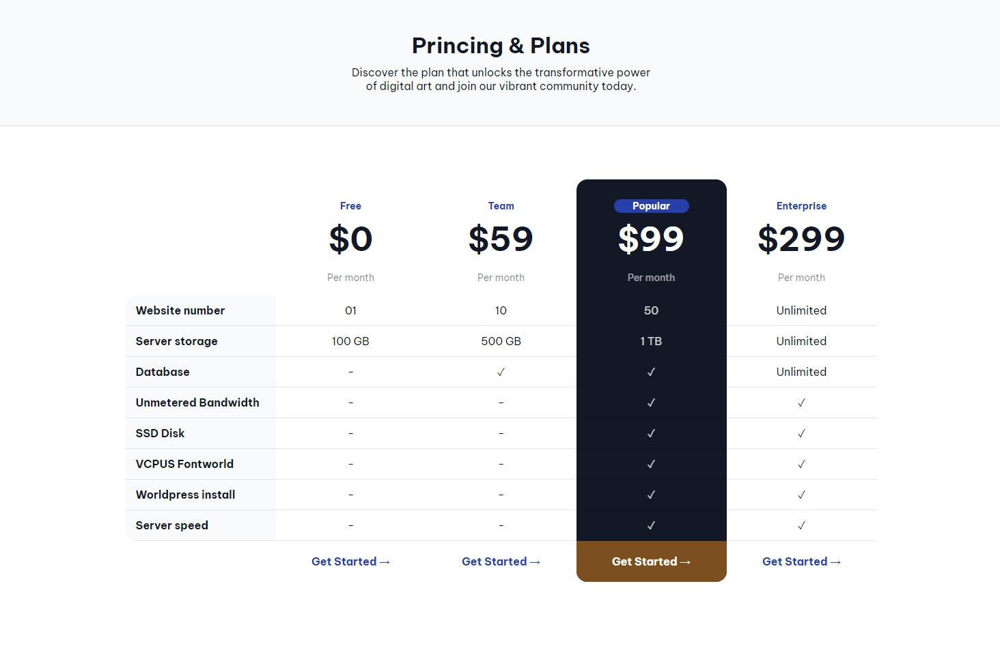

# Princing Table - Frontend Challenge

This is a simple pricing table created using CSS and HTML for practice purposes. It is a frontend challenge from [Devchallenges.io](https://devchallenges.io/).

## Technologies Used

- HTML
- CSS (Flexbox, Grid)

## Getting Started

Just open the html file in your browser and you are good to go.

## Credits

This project was created as part of the [Devchallenges.io](https://devchallenges.io/) challenge. Special thanks to Devchallenges.io for providing the inspiration and resources for this project.

## License

This project is licensed under the [MIT License](LICENSE).
